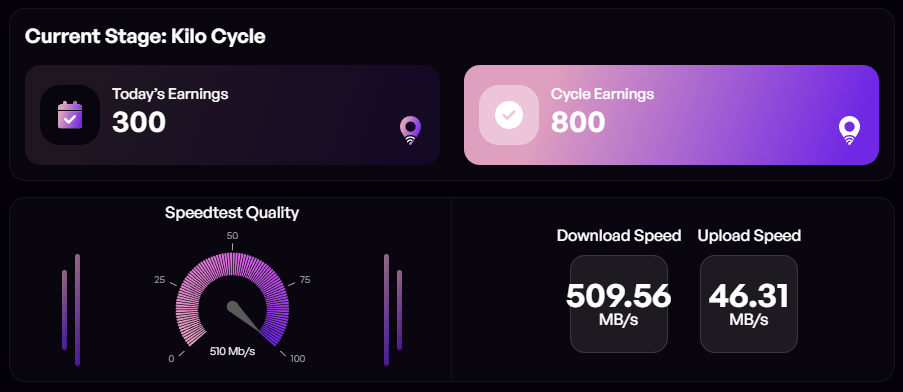
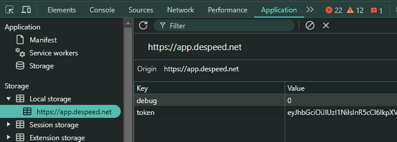

# DeSpeed Bot 自动发送速度测试质量报告


- 官网：[https://despeed.net](https://app.despeed.net/register?ref=EHP3FKKlEsK4)

## 功能特点

- **自动发送速度测试质量报告**
- **自动每日签到**
- **支持多账户**
- **支持代理使用**
- **每天发送速度测试结果有4次限制**，所以建议创建多个账户
 
## 使用前提

- 电脑上已安装 Node.js
- 按照以下步骤获取 Despeed 令牌：
- 在这里注册：[https://despeed.net/](https://app.despeed.net/register?ref=jbmZKASdeFIx)
- 登录后按 F12 或检查网页应用
- 在本地存储中找到 token 并复制其完整值
    

## 安装步骤

1. 克隆仓库：
    ```sh
    git clone https://github.com/0xbaiwan/despeed_bot
    cd despeed_bot
    ```

2. 安装所需依赖：
    ```sh
    npm install
    ```
3. 将令牌粘贴到 `tokens.txt` 文件中，每行一个令牌
    ```bash
    nano tokens.txt
    ```
4. 将代理信息粘贴到 `proxy.txt` 文件中：
-  格式为 `http://用户名:密码@ip:端口` 或 `socks5://用户名:密码@ip:端口`
    ```sh
    nano proxy.txt
    ```
5. 运行脚本：
    ```sh
    npm run start
    ```
## 代理服务（可选）

### 免费静态住宅代理
- [WebShare](https://www.webshare.io/?referral_code=gtw7lwqqelgu)
- [ProxyScrape](https://proxyscrape.com/)
- [MonoSans](https://github.com/monosans/proxy-list)

### 付费高级静态住宅代理
- [922proxy](https://www.922proxy.com/register?inviter_code=d6416857)
- [Proxy-Cheap](https://app.proxy-cheap.com/r/Pd6sqg)
- [Infatica](https://dashboard.infatica.io/aff.php?aff=580)

### 付费动态IP代理
- [IPRoyal](https://iproyal.com/?r=733417)
